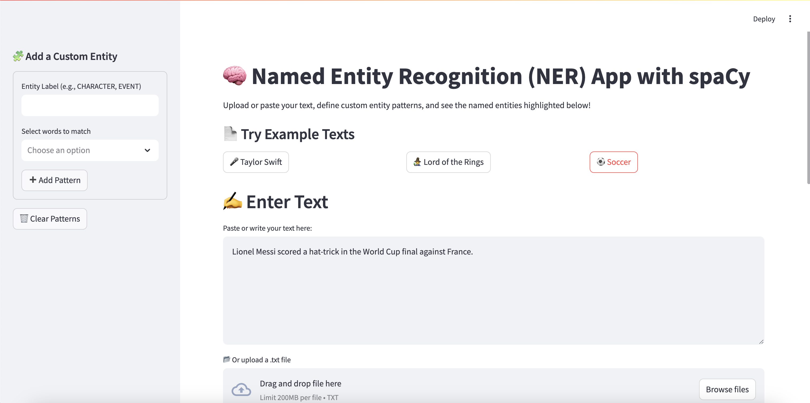
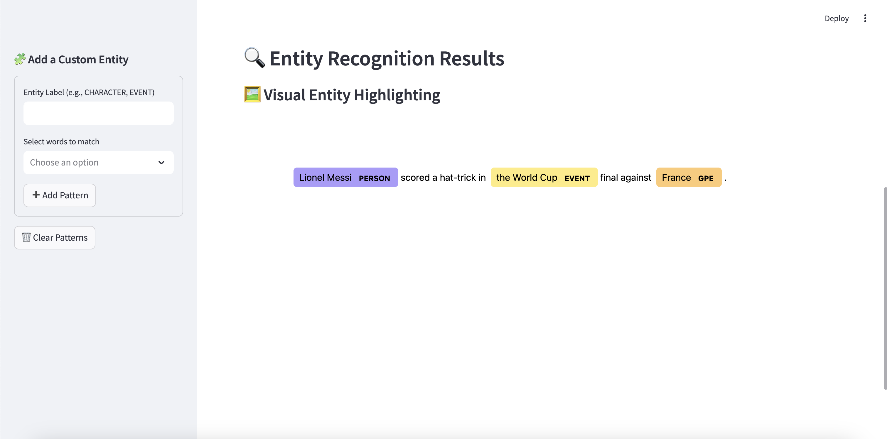

# 🧠 Named Entity Recognition (NER) App with Streamlit & spaCy

This interactive web app allows users to explore **Named Entity Recognition (NER)** using [spaCy](https://spacy.io/) and [Streamlit](https://streamlit.io/). You can upload your own text, define **custom entity labels and rules**, and visualize the recognized entities with clear, colorful highlighting.




---

## 🚀 Live Demo

👉 [Click here to try the app on Streamlit Community Cloud](https://kmgilland-gilland-python-portfolio-nerstreamlitappmain-5ok2sv.streamlit.app/)

---

## 📂 Project Structure

- `app.py` – Main Streamlit application
- `requirements.txt` – Python dependencies
- `README.md` – Project documentation
- `NERStreamlitApp/` – GitHub folder containing this app in my portfolio

---

## 🛠️ Features

- 🔤 **Text Input Options**: Paste your own text, upload a `.txt` file, or click from 3 fun example texts (Taylor Swift, Lord of the Rings, Soccer).
- 🧩 **Custom Entity Labeling**: Use a sidebar to define your own entity patterns with custom labels using spaCy’s `EntityRuler`.
- 🖼️ **Dynamic Entity Visualization**: See real-time entity highlighting using `displacy`, compatible with dark and light modes.
- 📄 **Pattern Saving**: Keep track of added patterns in a visual table.
- 💬 **Pretrained NER**: Uses spaCy's `en_core_web_sm` for built-in entities (people, places, organizations, etc.)

---

## 📥 How to Run Locally

1. **Clone the Repository**
   ```bash
   git clone https://github.com/kmgilland/NERStreamlitApp.git
   cd NERStreamlitApp


2. **Create a Virtual Environment**
   ```bash
   python -m venv venv
   source venv/bin/activate  # On Windows: venv\Scripts\activate


3. **Install Required Libraries**
   ```bash
   pip install -r requirements.txt


4. **Download spaCy Language Model**
   ```bash
   python -m spacy download en_core_web_sm


5. **Run the App**
   ```bash
   streamlit run main.py
