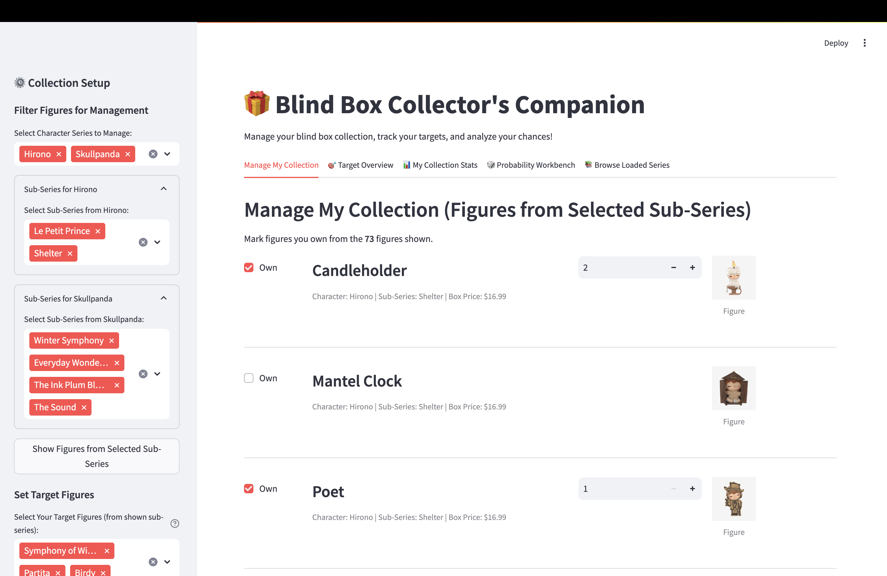
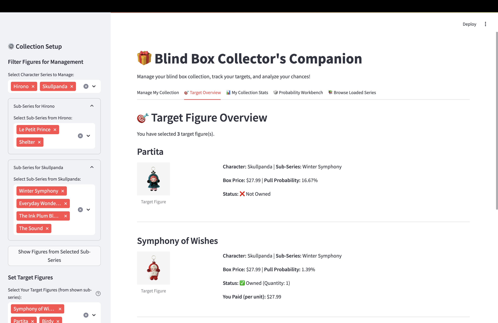
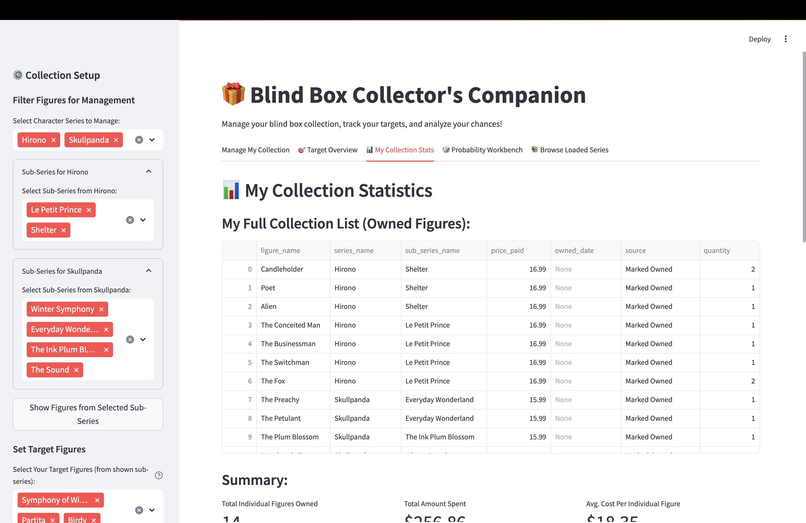
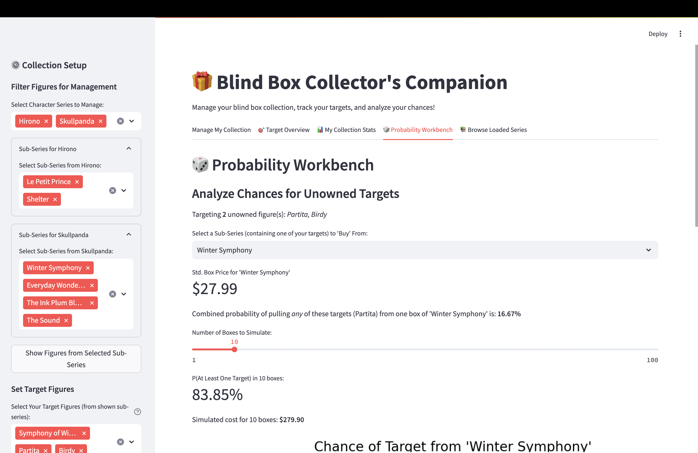
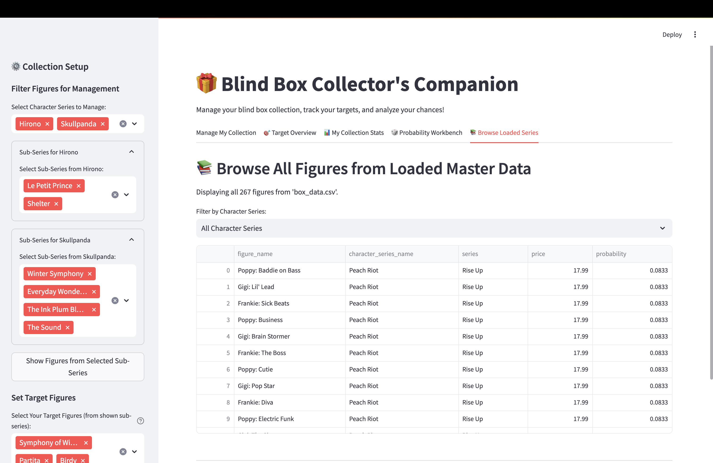

# 🎁 Blind Box Collector's Companion - Streamlit App

## Project Overview
The Blind Box Collector's Companion is a Streamlit application designed to help enthusiasts of blind box figures manage their collections, track desired ("target") figures, and analyze purchasing strategies. It addresses common challenges faced by collectors, such as keeping track of owned items (including duplicates), understanding spending, and evaluating the probability of obtaining specific figures from various series.

The app automatically loads figure data from a central `box_data.csv` file, allowing users to quickly get started with managing their collection.



## 🚀 Live Demo

👉 [Click here to try the app on Streamlit Community Cloud](https://kmgilland-gilland-python-port-streamlitappfinalstreamlit-it3xc5.streamlit.app/)

## 📂 Project Structure

- `Streamlit.py` – Main Streamlit application
- `box_data.csv` - Dataset
- `requirements.txt` – Python dependencies
- `README.md` – Project documentation
- `StreamlitAppFinal/` – GitHub folder containing this app in my portfolio
- `browse_loaded_series.png`, `manage_my_collection.png`, `my_collection_stats.png`, `probability_workbench.png`, `target_overview.png` - Example screenshots from app

## Dataset Description
The primary data source for the application is a single CSV file named `box_data.csv`. This file is expected to be in the same directory as the Streamlit application script and should contain the following columns:

* `character_name`: The main character line or brand (e.g., "Peach Riot", "Skullpanda", "Hirono").
* `series_name`: The specific collection or sub-series name (e.g., "Rise Up", "The Mare of Animals", "Shelter").
* `figure_name`: The unique name of the individual blind box figure.
* `price`: The standard retail price of one blind box from this series (e.g., "17.99" or "$17.99").
* `probability`: The chance of pulling this specific figure, expressed as a fraction (e.g., "1/12", "1/144").
* `figure_photo`: A URL to an image of the figure (e.g., [https://prod-america-res.popmart.com/default/20240419_151508_972393__1200x1200.jpg](https://prod-america-res.popmart.com/default/20240419_151508_972393__1200x1200.jpg))

## App Features

### Data Management & Setup (Sidebar)
* **Automatic Data Loading**: On startup, the app automatically loads and processes data from `box_data.csv`.
* **Filter Figures for Management**:
    * Users can select one or more "Character Series" (e.g., Peach Riot) from the loaded data.
    * For each selected character series, users can then select specific "Sub-Series" (e.g., Rise Up) to focus on.
    * A button ("Show Figures from Selected Sub-Series") filters the figures displayed in the "Manage My Collection" tab.
* **Set Target Figures**:
    * Users can select multiple "target" figures they are aiming to collect from the currently filtered list.
* **Add/Edit Other Owned Figures**:
    * **Manual Entry**: A form allows users to manually add or update figures in their personal collection, including figure name, character series, sub-series, price paid, quantity owned (defaults to 1), acquisition date, and source.
    * **CSV Upload**: Users can upload their existing collection data via a CSV file. The app expects columns: `figure_name`, `series_name` (character series), `sub_series_name`, `price_paid`, `owned_date` (optional), `source` (optional), and `quantity` (optional, defaults to 1).

### Main App Functions & Outputs (Tabs)

1.  **Manage My Collection**:
    * Displays figures from the sub-series filtered via the sidebar.
    * For each figure, users can:
        * Mark it as "Owned" using a checkbox.
        * If owned, specify the **quantity** of that figure they possess using a number input (defaults to 1).
    * This interaction updates the user's personal collection. Figures marked as owned are added with their box price (from `box_data.csv`) and the specified quantity.
    * Shows a summary of the personal collection (figures with quantity > 0).

2.  **Target Overview**:
    * Lists all selected target figures.
    * For each target, displays its image (if available), character series, sub-series, box price, and pull probability.
    * Indicates "Owned" status and the **quantity owned** if the figure is in the user's collection with a quantity greater than 0.
    * Shows the price paid per unit if the figure is owned.

3.  **My Collection Stats**:
    * Displays the user's full personal collection table (figures with quantity > 0).
    * Key metrics calculated based on owned quantities:
        * **Total Individual Figures Owned**: Sum of quantities of all unique figures.
        * **Total Amount Spent**: Sum of (price paid per unit \* quantity) for all owned figures.
        * **Average Cost Per Individual Figure**.
    * A histogram showing the distribution of prices paid per unit, reflecting the quantities owned.

4.  **Probability Workbench**:
    * Focuses on unowned target figures (targets not in the collection or with quantity 0).
    * Users select a sub-series (that contains one of their unowned targets) to simulate "buying" from.
    * Calculates and displays:
        * Standard box price for the selected sub-series.
        * Combined probability of pulling *any* of the unowned targets from that sub-series in one box.
        * An interactive slider to choose the number of boxes to simulate buying.
        * The probability of obtaining at least one target within that number of boxes.
        * The total simulated cost for the chosen number of boxes.
        * A line plot illustrating how the probability of obtaining at least one target increases with the number of boxes purchased.

5.  **Browse Loaded Series**:
    * Displays all figures from the loaded `box_data.csv`.
    * Allows filtering by character series and then by sub-series.
    * Shows figure name, character series, sub-series, price, and probability for easy browsing.

## Setup & Run Instructions

### Prerequisites
* Python (3.8 or newer recommended)
* pip (Python package installer)

### Local Installation & Running
1.  **Clone the Repository (or Download Files):**
    If this project is in a Git repository:
    ```bash
    git clone <repository-url>
    cd <repository-directory>
    ```
    Otherwise, download the `Streamlit.py` script and your `box_data.csv` file into the same directory.

2.  **Create a Virtual Environment (Recommended):**
    ```bash
    python -m venv venv
    source venv/bin/activate  # On Windows: venv\Scripts\activate
    ```

3.  **Install Dependencies:**
    Locate the `requirements.txt` file in your project directory. Then, install the dependencies:
    ```bash
    pip install -r requirements.txt
    ```

4.  **Prepare Data File (`box_data.csv`):**
    Ensure your `box_data.csv` file is in the same directory as `Streamlit.py` and formatted according to the "Dataset Description" section above.

5.  **Launch the Streamlit App:**
    Open your terminal, navigate to the directory containing `Streamlit.py` and `box_data.csv`, and run:
    ```bash
    streamlit run Streamlit.py
    ```
    The app should open in your default web browser.

## Error Handling & Usability
* The app automatically attempts to load `box_data.csv` on startup and provides clear error messages for critical issues (e.g., file not found, missing essential columns, empty file).
* Input fields for manual entry are clearly labeled with required fields marked.
* Calculations (like probability and statistics) handle potential edge cases and data types.
* Visualizations are titled and labeled for clarity.
* Session state is used extensively to preserve user inputs, selections, and collection data across interactions.

## Potential Next Steps
* Implement more advanced filtering options in the "Browse" tab.
* Add functionality to export the user's collection data.
* Introduce user accounts for saving collections persistently.

## Visual Examples

**Example Screenshot: Manage My Collection Tab**


**Example Screenshot: Target Overview Tab**



**Example Screenshot: My Collection Stats Tab**



**Example Screenshot: Probability Workbench Tab**



**Example Screenshot: Browse Loaded Series Tab**




## References & Resources
* **Streamlit Documentation:** [https://docs.streamlit.io/](https://docs.streamlit.io/)
* **Pandas Documentation:** [https://pandas.pydata.org/pandas-docs/stable/](https://pandas.pydata.org/pandas-docs/stable/)
* **NumPy Documentation:** [https://numpy.org/doc/](https://numpy.org/doc/)
* **Matplotlib Documentation:** [https://matplotlib.org/stable/contents.html](https://matplotlib.org/stable/contents.html)
* **Seaborn Documentation:** [https://seaborn.pydata.org/api.html](https://seaborn.pydata.org/api.html)
* **Blind Box Data:** [https://www.popmart.com/](https://www.popmart.com/)
