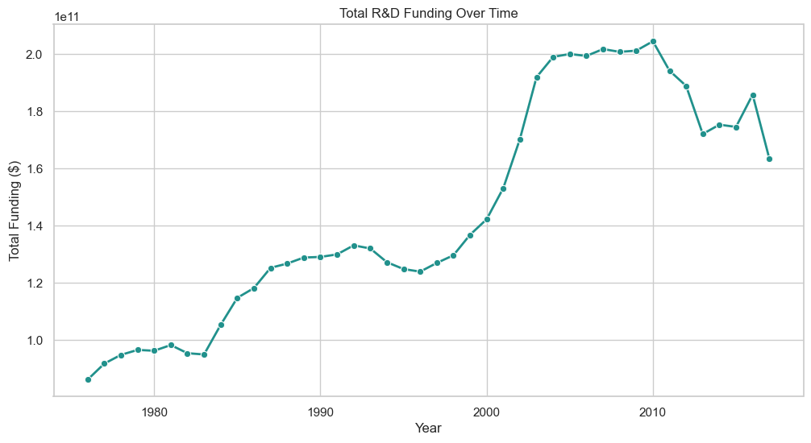
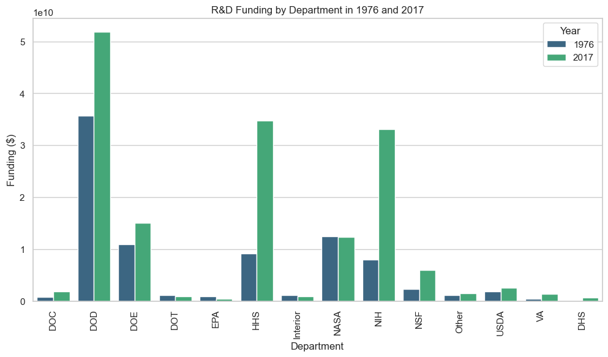
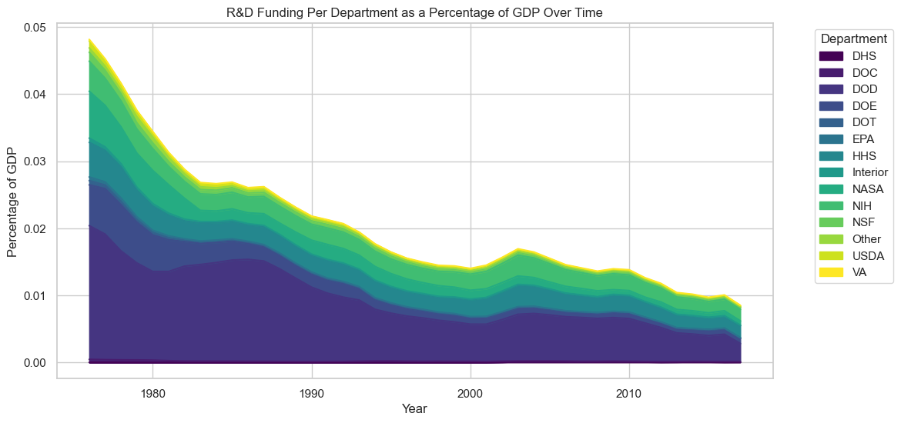
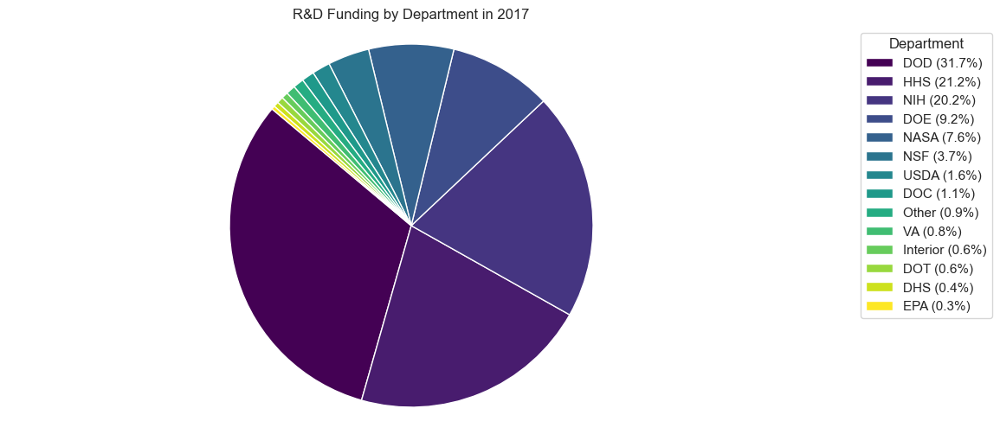

# 📈 Tidy Data Cleaning and Analysis

## 🌟 Project Overview
This project focuses on cleaning and transforming a dataset containing U.S. federal research and development (R&D) funding across various departments from 1976 to 2017. The dataset also includes GDP values for each year. Using **Tidy Data Principles**, I reshaped and cleaned the dataset to ensure:
- Each variable is in its own column.
- Each observation forms its own row.
- Each type of observational unit forms its own table.

## 📊 Dataset Description
The dataset originally contained:
- `department`: Government departments receiving R&D funding.
- Multiple columns named in the format `year_gdpXXXXX`, combining **year** and **GDP**.
- Funding amounts scattered across multiple columns.

## 🧹 Data Cleaning Steps
1. **Reshaping Data**: I used `melt()` to transform the dataset from wide to long format, ensuring each year is an individual observation.
2. **Separating Variables**: I used `str.split()` to extract **year** and **GDP** into separate columns.
3. **Converting Data Types**: I changed `year` to an integer and `gdp` to a float for consistency.
4. **Removing Redundant Columns**: I dropped the original `year_gdp` column after extraction.
5. **Handling Missing Values**: I ensured missing funding values are handled appropriately.

## 🗂 Aggregation
- I created a **pivot table** to compute the total **R&D funding per year**.
- This provides insights into **long-term trends in federal R&D investments**.

## 🖼 Visualizations
To better understand the cleaned data, I generated the following visualizations:

1. **Line Plot:** Total R&D funding over time, showing trends in investment.

2. **Bar Chart:** R&D funding by department for the first and most recent year.

3. **Streamgraph:** R&D Funding Per Department as a Percentage of GDP Over Time.

4. **Pie Chart:** R&D spending by department in 2017, sorted by funding amount and displayed with a legend including percentage values.

## ❓ Why Tidy Data?
Following **Hadley Wickham’s Tidy Data Principles**, I ensured:
- **Ease of analysis**: The dataset is now structured for efficient filtering, grouping, and summarization.
- **Compatibility with analytical tools**: The cleaned data is now ready for statistical modeling and visualization.
- **Improved readability**: Each column represents a distinct variable, making interpretation straightforward.

## 🚀 Potential Next Steps
- Further analyze R&D spending trends in relation to GDP.
- Visualize funding trends over time.
- Explore department-level funding variations.

## 📚 References
- Hadley Wickham. "Tidy Data." *Journal of Statistical Software*, 2014. [https://vita.had.co.nz/papers/tidy-data.pdf](https://vita.had.co.nz/papers/tidy-data.pdf)
- Pandas Cheat Sheet: [https://pandas.pydata.org/Pandas_Cheat_Sheet.pdf](https://pandas.pydata.org/Pandas_Cheat_Sheet.pdf)

