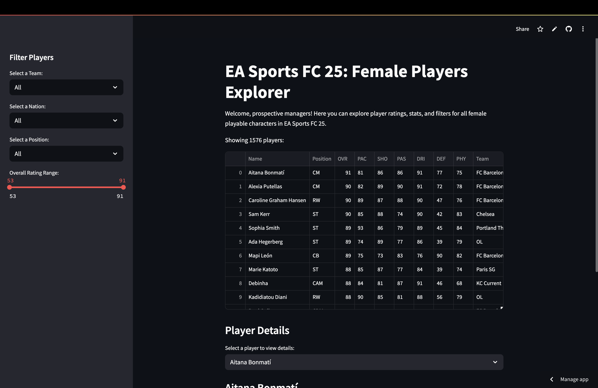
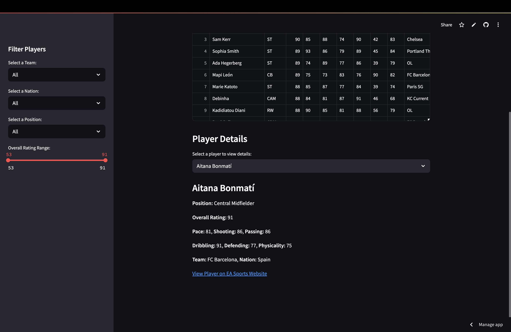

⚽ EA Sports FC 25 - Female Players Explorer
=========================================

🌟 Overview
--------

Welcome to the **EA Sports FC 25 - Female Players Explorer**! This Streamlit app allows users to explore and filter **female playable character data** from **EA Sports FC 25**. Users can filter players by **team, nationality, position, and overall rating**, as well as view detailed stats for selected players.




## 🚀 Live Demo

👉 [Click here to try the app on Streamlit Community Cloud](https://kmgilland-gilland-python-portfol-basic-streamlit-appmain-diqvfb.streamlit.app/)

🛠 Features
--------

-   **Filter players** by team, nationality, position, and overall rating.

-   **View key stats** including Pace, Shooting, Passing, Dribbling, Defending, and Physicality.

-   **Includes advanced Goalkeeper stats** such as Diving, Handling, Kicking, Positioning, and Reflexes.

-   **Select a player** to see their full details, including un-abbreviated position names.

-   **Access player profiles** via links to EA Sports' website.

-   **Handles empty selections** by displaying a message if no players match the filters.

🖥 Installation
------------

1.  Clone the repository:

    ```
    git clone https://github.com/kmgilland/GILLAND-Python-Portfolio/tree/main/basic_streamlit_app.git 
    cd basic_streamlit_app
    ```

2.  Ensure that Python, Pandas, and Streamlit are all installed.

3.  Run the app:

    ```
    streamlit run main.py
    ```

📚 Dataset
-------

-   The app loads data from `female_players.csv`.

-   Ensure this file is in the `data/` directory.

-   All data is sourced from [The Complete EA Sports FC Database](https://www.kaggle.com/datasets/nyagami/ea-sports-fc-25-database-ratings-and-stats/data) 

⚙️ Usage
-----

-   Open the sidebar to filter by **Team**, **Nation**, **Position**, or **Overall Rating**.

-   Click on a player to see more details.

-   Click on the player's profile link (if available) to visit EA's website.

-   If no players match the selected filters, a message will appear instead of an error.

📒 License
-------

This project is for educational purposes and is not affiliated with EA Sports.
